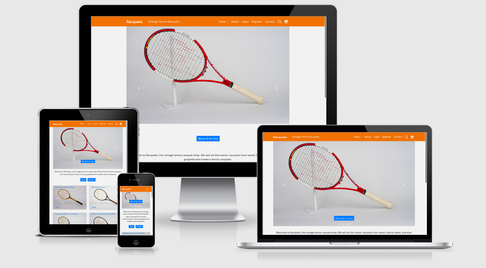
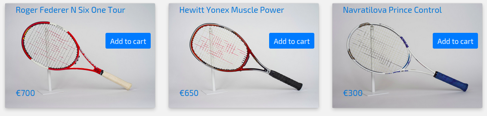
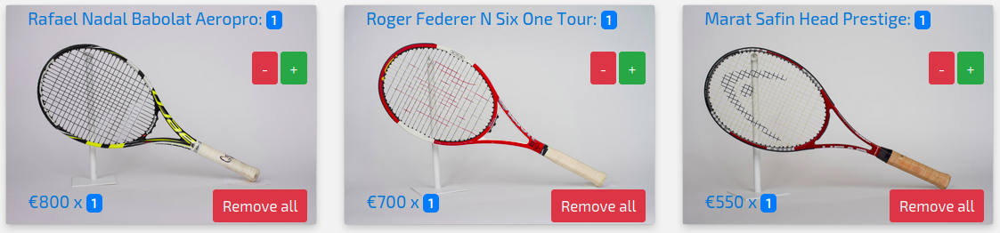
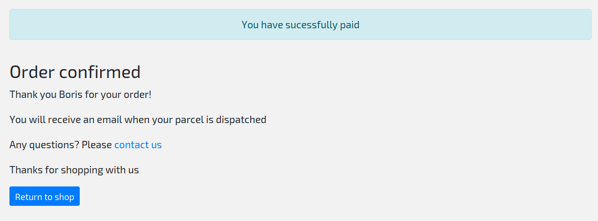
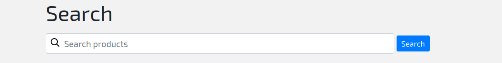

# Racquets - a Django online tennis racquet shop

[Racquets](https://web-production-84b6.up.railway.app/) is the fourth milestone project for the Code Institute Full Stack Software Development Diploma. It is a fictional tennis racquet shop that allows tennis lovers to browse the racquets of past champions, with a wide variety of racquets available, from wood to metal, hybrid, graphite composite and modern frames. Many of the items on display are collectors items, and the website would appeal to both tennis enthusiasts and collectors alike.
- Please note the **second contributor** to the project is the unintended consequence of the acceptance of an automated pull request from the Github Dependabot to upgrade the Django version that was initially used. Please refer to the commit history for more details. There is only 1 contributor.

# Table of Contents

- [Racquets - a Django online tennis racquet shop](#racquets---a-django-online-tennis-racquet-shop)
- [Table of Contents](#table-of-contents)
	- [UX and Design Planning](#ux-and-design-planning)
		- [Wireframes](#wireframes)
		- [Project Design Summary](#project-design-summary)
		- [User Stories](#user-stories)
		- [App Content](#app-content)
		- [App Style](#app-style)
	- [Features](#features)
		- [Navbar](#navbar)
		- [Home page](#home-page)
		- [Shop](#shop)
		- [Product list or all racquets pages](#product-list-or-all-racquets-pages)
		- [Product detail or individual product pages](#product-detail-or-individual-product-pages)
		- [Cart](#cart)
		- [Checkout](#checkout)
		- [Payment confirmation](#payment-confirmation)
		- [Register](#register)
		- [Login](#login)
		- [Logout](#logout)
		- [Account](#account)
		- [About](#about)
		- [Contact](#contact)
		- [Search](#search)
	- [Features to be implemented](#features-to-be-implemented)
	- [Technologies Used](#technologies-used)
	- [Resources](#resources)
	- [Testing](#testing)
		- [Unit Testing](#unit-testing)
		- [Functional Testing](#functional-testing)
		- [Using the django shell for testing form and model functionality](#using-the-django-shell-for-testing-form-and-model-functionality)
		- [User Registration testing](#user-registration-testing)
		- [User Login testing](#user-login-testing)
		- [Account page testing](#account-page-testing)
		- [User logout testing](#user-logout-testing)
		- [Contact Form testing](#contact-form-testing)
		- [Search testing](#search-testing)
		- [Cart testing](#cart-testing)
		- [Checkout and payment testing](#checkout-and-payment-testing)
		- [Payment confirmation testing](#payment-confirmation-testing)
		- [Further testing](#further-testing)
	- [Bugs and known issues](#bugs-and-known-issues)
	- [Content credits](#content-credits)
	- [Acknowledgements](#acknowledgements)
	- [Deployment](#deployment)
		- [Local Deployment](#local-deployment)
		- [Instructions](#instructions)
		- [Remote Deployment](#remote-deployment)
	- [Notice](#notice)

 ## UX and Design Planning 

Please view the [project strategy document](planning.md) for the app, which details the project strategy, including the project planning of the UX and UI, scope, structure, skeleton and surface. 

### Wireframes

The wireframes for the project, created with [Balsamiq](https://balsamiq.com/), can be found [here](https://github.com/ey7/project-four/tree/master/wireframes)

### Project Design Summary

- The app will be a fully functional django powered online vintage tennis racquet shop. Users will have the chance to register for a seamless shopping experience.
- Products will be displayed as attractive cards with interesting descriptive content on the product pages.
- Users can add items to their cart as they browse the site.
- The app will have a shopping cart page, where users can view the items in their cart.
- Further shopping pages of address and shipping details will allows purchasers to enter their personal information.
- A special payment page will handle all payments, which will be implemented in the backend by Stripe.
- Once payment is successful, a payment confirmation page will appear with shop contact details.
- The app will have full user registration, authorization and authentication functionality with hashed passwords.
- Search functionality with a searchbox will be implemented on the products page.
- Pagination will be implemented on the products page to limit the number of visible entries.

### User Stories

- As a user, I want to be able to browse vintage tennis racquets and read about their history.
- As a user, I want to be able to navigate easily around the site and find the information I need.
- As a user, I want to be able to register easily to make purchases if I wish, with my contact and shipping details.
- As a user, I want to be able to easily edit my personal information on my account page.
- As a user, I want proper security and peace of mind when making online purchases.
- As a user, I want a good user experience when browsing the website and making purchases, for a hassle free online shopping experience.
- As a user, I want a well designed, logical shopping flow from cart through to checkout and payment.
- As a user, I want well designed shopping pages that clearly detail taxes, surcharges and shipping costs included in the total price.
- As a user, I want to be able to make an easy hassle free purchase with my credit card or paypal.
- As a user, I want to be able to easily add and remove items from my shopping cart.
- As a user, I want to be able to easily add and edit my contact, address and shipping details.
- As a user, I want a confirmation page after I successfully make a purchase.
- As a user, I want to be able to easily find contact information if I wish to make product enquiries.

### App Content

The app consists of over 10 pages relating to app functionality, such as home, about, account, login, register, search, as well as pages relating to the online shop, such as cart, address, shipping, payment and payment confirmation.

### App Style 

- A primary colour of orange with a secondary colour of blue on the buttons and product cards throughout for visual consistency.
- A modern sans serif font of Exo 2.
- An off white background with dark grey text for optimum readability.
- To improve the UX, I used SVG icons from [Zondicons](https://www.zondicons.com/) throughout the site. In my opinion, SVG icons look crisper and are easier to work with than font icons. When placed inline they are easier to style and manipulate for hover colour change effects, and they also load on the page much faster than font icons. 

## Features

### Navbar

The navbar is displayed on all pages. When logged out, it displays links to home, shop, about, login, register, contact, search and cart. Only logged in users can add items to cart. 

When logged in, all navbar links are the same, except that login is replaced by an account link, and the register link is replaced by a logout link for the user to log out. 

### Home page

The home page uses an attractive sliding carousel with a selection of three product images with links. Below the carousel is a brief description of what the website is about, with two buttons that link to the shop and the about page. Below the buttons, a selection of random product cards (x6) is displayed to the customer. Every time the home page is visited or refreshed, a new selection is available.

### Shop

The shop link in the navbar provides a dropdown of options, from all racquets to the five categories of wood, metal, oversize, graphite and modern racquets. The all racquets page displays all products with product cards, with pagination to limit the number of products displayed to 6. Clicking on a category page will display the products for that category.

### Product list or all racquets pages

The product list pages display all shop products through the use of cards with images, links and price, paginated by 6 per page. On each product is an add to cart buttton, which will add the product to the user's card, but only if they are logged in. There are numbered buttons and next and previous buttons to allow the user to browse the various product pages. 

### Product detail or individual product pages

If a user clicks on the title on any product card, it acts as a link to the individual product detail page which has a more detailed description of the product on offer. An add to cart button on the product card entices the user to add the item to their cart. 

### Cart 

- When a user is logged in and hits an add to cart button on any item, the item will be added to their cart. If the cart is not empty, a badge will display beside the cart icon in the navbar, displaying the product count and number of items in their cart. Clicking the cart button in the navbar will bring the user to their cart page. If not logged in, they will be redirected to the login page. If logged in, the users cart items will be displayed as product cards.  

- On each cart item card, there will be three buttons to modify the cart. A plus button allows the user to increment the quantity for that particular item. A minus button will decrement the quantity. A third button on each cart item will allow the user to remove all of that particular item from the cart. On each cart item will be badges displaying clearly the quantity. A cart product total and total price will display underneath, along with a checkout button. 

### Checkout

The checkout page will display any cart items for checkout at the top of the page. Underneath there are forms for payment, one form for billing address details and the other for payment details such as credit card. Once both forms are completed, the user can click the buy now button at the bottom. Once both forms validate with no errors, credit card payment will be handled in the backend with Stripe. If sucessful, the user will be redirected to the payment confirmation page with a success alert message. Errors will be displayed as alert messages and the user will be asked to re-enter their details. 

### Payment confirmation

This page will appear after a sucessful payment transaction, and will tell the user that their payment was sucessful. The user will be thanked for shopping with the website, and a link to the shop and contact page is available. 

### Register

A user may register to use the site by entering their username, email and password. They must also confirm their password in a fourth field before validation. Once the form is validated and there is no duplicate username in the database, the new user is created with a success message alert and will be redirected to the login page.

### Login

A user may log into the app by entering their username and password. Once the form is validated with no errors, the user is logged in with a success message alert and redirection to the home page.

### Logout

Once logged in, a user may logout of the app at any time by clicking on the logout button in the navbar. This logs the user out with a success message alert and a redirect to the homepage.

### Account

Once logged in, the user may access a page that welcomes them with their username and gives them the option to update their username and email. Once the form is validated with no errors, the username and email will be updated in the database. Due to time constraints, password reset was not implemented.

### About

The about page contains an image of a tennis player, racquet in hand, along with a brief description of what the website is all about, the sale of vintage tennis racquets. At the bottom of the page is a link to the shop, where users can browse the products available.

### Contact

A contact page gives the user the ability to send a message to the shop owner. There are fields for name, email and message. All are required and once the form is validated with no errors, the app uses EmailJS in the background to redirect the message to the shop owner's email account. An alert modal will display on the screen to tell the user of success, or failure in the case of errors. 

### Search

The user may start a search by clicking on the search icon in the navbar. This brings up the search page with a search box at the top. The search operates by searching on title and category fields in the products database and will return matches in the form of product cards with images and links. The links will bring the user to the individual product detail page where more information is available.  

## Features to be implemented

- Password reset: I would like to implement this useful feature for customers. It was not implemented due to time constraints.
- Paypal payment: At present there is only credit card payment through Stripe available on the site. Many people enjoy the convenience of Paypal.
- Dispatch email: Similar to password reset, this would be a very useful feature which would notify the customer when their product was dispatched.
- Custom error pages: Django has very basic error pages for 404 and 500 errors for example. It would be nice to implement custom error pages with back links. 

## Technologies Used

- HTML and CSS for website layout and design.
- [Bootstrap](https://getbootstrap.com/) for modern styling with responsive navigation, forms and buttons. 
- [Javascript](https://developer.mozilla.org/en-US/docs/Web/javascript) for site functionality.
- [Jquery](https://jquery.com/) and [Popper Js](https://popper.js.org/) for Bootstrap functionality.
- [Django](https://www.djangoproject.com/) Python framework for web development.
- [Python](https://www.python.org/) as the programming language behind Django.
- [Google fonts](https://fonts.google.com/) for fast loading of modern fonts.
- [Git](https://git-scm.com/) for version control and [Github](https://github.com/) for repository hosting.
- [EmailJS](https://www.emailjs.com/) for transfer of emails from contact form to personal email.
- [Cloudinary](https://www.cloudinary.com/) to host uploaded images for products.
- [Heroku](https://heroku.com/) to host the site.
- [Balsamiq](https://balsamiq.com/) for mock ups of the site.
- [SqLite](https://www.sqlite.org/index.html) as a development database.
- [Postgres](https://postgresql.org) as a production database.
- [Stripe](https://stripe.com/) for online payment processing.
- [E-Modal](http://saribe.github.io/eModal/) for alert popup modals on contact page.
- [Zondicons](https://www.zondicons.com/) for modern SVG icons.
- [Whitenoise](http://whitenoise.evans.io/en/stable/) so the web app can serve static files on Heroku.
  
## Resources

- [Stackoverflow](https://stackoverflow.com/)
- [MDN Mozilla Docs](https://developer.mozilla.org/en-US/)
- [W3 Schools](https://www.w3schools.com/)
- [CSS Tricks](https://css-tricks.com/)
- [Django Documentation](https://docs.djangoproject.com/en/2.2/)
- [Python Docs](https://docs.python.org)
- [YouTube](https://www.youtube.com)
- [Responsinator](https://www.responsinator.com/)
- [Am I Responsive](http://ami.responsivedesign.is/)
- [Google](https://www.google.com)
  
## Testing

- The Django debugger was in constant use during development, in particular with the building of the backend functionality, routes and functions. Any errors or exceptions were investigated.
- All possible user actions relating to forms for user authentication and payment were tested on the forms of each and every page, to ensure that the app was stable and did not crash.
- The error pages such as 404 were tested to ensure they displayed correctly if an errant url was entered, or the server gave a 500 error.
- Similarly all navigation links, back and forward buttons and submit and routing buttons were tested to ensure that everything was working as intended.
- All user registration, login, authentication, cart, checkout and payment functionality were tested to ensure that all the required queries and actions were being perfomed on the database correctly.

### Unit Testing

- Unit tests were written in the individual apps to check the integrity and funtionality of the code. To run these tests, use the following command in the project root:

`python manage.py test`

### Functional Testing

- An example functional test was written, based on material found in the [Testing Goat](https://www.obeythetestinggoat.com/book/chapter_02.html). This test can be found in the file functional_tests.py, in the project root. I found this ascpect of testing, using Selenium and Webdriver to activate functional browser site testing, very exciting. The original intention was to write more functional tests, but this was shelved due to time constraints.

- To run this test on localhost, you need to have two terminal shells open in your project virtual environment folder:
- In the first shell, type the following to run the Django server: 

`python manage.py runserver`

- In the second, type the following to run the functional tests:

`python functional_tests.py`

### Using the django shell for testing form and model functionality

Many of the website operations involve the use of a form, to create, read, update and delete data in the database, such as register, login, products, orders etc. Whenever any of the subsequent features were tested, I opened a django shell with the following command:

`python manage.py shell`

This would allow me, via the command line, to query the items in the database and verify that, for example, after registration, a new user had been correctly added to the database during registration.

### User Registration testing

I added my new user details into the register form, the form validates and redirects to the login page with an alert message that you are registered, with a prompt to login. A subsequent sucessful login attempt confirmed that the registration action was a success. Incomplete, incorrect or missing form fields were rejected and the form would not validate.

### User Login testing

An attempt to login resulted in a success message with a redirect to the home page. Incomplete, incorrect or missing form fields were rejected and the form would not validate. Throughout the site I can complete all the actions for an authorized user, such as update my email and username, and add items to the shopping cart, checkout and pay for a product. Once logged in, the register and login navlinks were replaced by account and logout.

### Account page testing

Once logged in, a user will be presented with a navbar link to their account page, with the option to change their username and/or password. Both username and/or password can be changed sucessfully with a success message to confirm. Incomplete, incorrect or missing form fields were rejected and the form would not validate.

### User logout testing

Cliking on the navbar link to logout resulted in a success message alert that the user had been logged out. The register and login links were again present on the navbar, while the logout and account links were now no longer visible. The logout function was working as intended. 

### Contact Form testing

In the contact form, I added my name, email and message and hit the send button. A popup alert displays as intended, with the meessage that their email has been sent. I then checked my email to confirm that the message had been received sucessfully. Incomplete, incorrect or missing form fields were rejected and the form would not validate.

### Search testing

Clicking on the search icon in the navbar displayed the search page. Upon entering a search term in the searchbox, any sucessful results were displayed as product cards across the page. If there were no results returned, a default message would display telling the customer that no results were found.  

### Cart testing

- Only registered users can add items to the cart. As a non logged in user, I tried to add items to the cart and was not able. I was redirected to the login page and prompted to login. As a logged in user, I was easily able to add items to the cart, using the add to cart button found on product cards across the site. 
- On the cart page itself, I was able to increment and decrement the quantity of each individual cart item as intended. The remove all button also worked correctly. The checkout button worked correctly and brought me to the checkout and payment page. 

### Checkout and payment testing

I was able to add my billing address and payment details on the checkout page. Incomplete, incorrect or missing form fields were rejected and the form would not validate. For Stripe test payments with the test API keys, I added the credit card number of 4242 4242 4242 4242, followed by the CVV code of 111. This worked as intended and I received a payment sucess alert message. I inputted an incorrect credit card number and an error message displayed as intended.

### Payment confirmation testing

A successful payment transaction redirected me to the payment confirmation page. The fullname entered on the form was displaying correctly on this page, along with the link for contact and the button to return to the shop at the bottom. Once payment is confirmed, I  confirmed that the user's cart was now empty.

### Further testing

- The app was tested using developer tools throughout the project on multiple browsers - Chrome, Mozilla & Opera etc.
- The developer console was used throughout the project to check for alignment and layout issues, and for javascript errors and warnings.
- The links and buttons on all pages were manually tested to ensure everything was working correctly.
- All breakpoints were tested for different screen sizes and viewports.
- The app was tested on [Responsinator](https://www.responsinator.com/) and [Am I Responsive](http://ami.responsivedesign.is/) to ensure that the site pages were rendering correctly on all types of devices and orientations, such as Ipad and Iphone.
- The app was put through the [HTML5 Validator](https://validator.w3.org/) and some errors and warnings related to the Django templating language were flagged. Django templating language is not recognised so this is normal.
- The app was put through the [CSS Validator](https://jigsaw.w3.org/css-validator/) and some errors were uncovered related to the Bootstrap css which is not something that I can control. My own css code was error free.
- The javascript code used on the site was tested using [JSHint](https://jshint.com/). Some unecessary semi colons were highlighted and removed from the code.
- I also tested the website on [google mobile friendly](https://search.google.com/test/mobile-friendly) and recieved a mobile friendly result. 
- I tested the website on personal and other family devices such as my laptop and Android mobile phone, iPad and iPhone and Samsung Galaxy Tab in both potrait and landscape orientations.

## Bugs and known issues

- **Please note the second contributor to the project is the unintended consequence of the acceptance of an automated pull request from the Github Dependabot to upgrade the Django version that was intially used. Please refer to the commit history for more details. There is only 1 contributor.**

- I had an issue with the login required decorator which was attached to the add product to cart function where the next parameter witin the url was redirecting to a page that didn't exist, and this was causing an error on sucessful authentication. After some trial and error I figured out that I could set the redirect_field_name=None within the login required decorator, and the bug was resolved.

- The use of Django's class based views such as ListView was very convenient for the display and pagination of the all racquets pages. However it gave me some issues with the implementation of the search functionality, which was originally intented to be available on the all racquets page. As a workaround, I decided to implement the search function as a standalone page which worked out well. 

- On the cart page the user is able to increment and decrement individual cart item quantities using the plus and minus buttons. I then realized that maybe the user had multiple cart items of a particular product and would like to remove them all at once. 

- I then had to write an additional function and insert another button that would allow this. Hitting the minus button when the cart item quantity is 1 will delete that particular cart item completely from the cart. This might have unintended consequences for the user.

## Content credits

- The favicon for the site was downloaded for free from [iconscout](https://iconscout.com/).
- SVG icons throughout the site were used courtesy of [Zondicons](https://www.zondicons.com/).
- Product Card images and descriptive product text for each racquet on the site was taken from [Smash Hit tennis website](https://racquets.tennisfame.com/)
- No copyright infringement is intended as this is an educational project.

## Acknowledgements

- The use of external code has been credited in the code. 
- I also found the following resources very useful:

- [Corey Schafer](https://www.youtube.com/user/schafer5) for his Django YouTube course.
- [Pretty Printed](https://www.youtube.com/channel/UC-QDfvrRIDB6F0bIO4I4HkQ) on all things Python and Django.
- [MDN Web Docs](https://developer.mozilla.org/en-US/docs/Learn/Server-side/Django) Django course, in particular part 6 which explains class and list based views very well.
- [William Vincent](https://wsvincent.com/django-slug-tutorial/) for his excellent tutorial on how to implement slugs in Django.
- [Django Search](http://www.learningaboutelectronics.com/Articles/How-to-add-search-functionality-to-a-website-in-Django.php) on how to implement search in Django.
- [William Vincent](https://wsvincent.com/django-models-best-practices/) on Django models best practices
- [Obey the Testing Goat](https://www.obeythetestinggoat.com/) an excellent resource on testing and test driven development.

## Deployment

### Local Deployment

To deploy locally, firstly you need the following:

- A code editor such as Visual Studio Code, Sublime Text, Atom or another of your choosing.

You must have the the following installed on your machine:

- [PIP](https://pip.pypa.io/en/stable/installing/)
- [Python 3](https://www.python.org/downloads/)
- [GIT](https://git-scm.com/downloads)

### Instructions

1. Save a copy of the github repository located at https://github.com/ey7/project-four by clicking the "download zip" button at the top of the page and extracting the zip file to your download folder. If you have Git installed on your machine, you can clone the repository with the following command:

`git clone https://github.com/ey7/project-four`

2. If your code editor has an integrated terminal, open a terminal and change directory (cd) to the directory where your extracted files are located. Otherwise, open a terminal on your machine.

3. A python virtual environment on your machine is recommended. I use [virtualenv](https://virtualenv.pypa.io/en/latest/), but there are others. Follow the instructions for your operating system to install and set up a virtual environment for your project.

4. In your new virtual project environment, install all the required modules (including Django) for the project:

`pip -r requirements.txt` 

5. Set up the environment variables as found in the settings.py file of the shopper app.
You can do this by using an env.py file or by storing the environment variables in a .bashrc file, depending on your set up.

6. Ensure that your virtual environment for the project is still active before running the following command in the project root:

`python manage.py runserver`

7. Your project should now be running on your localhost, port 8000:(http://www.localhost:8000/)

8. You then need to makemigrations and run migrations on the app models:

`python manage.py makemigrations` folowed by `python manage.py migrate`

9. To access the admin section, you must create a superuser:

`python manage.py createsuperuser`

10. To reveal the admin log in screen, type the following url:

`http://www.localhost:8000/admin`

11. You can then log in with your new admin credentials, and create new products for your local Sqlite database, so that the project will run as intended. 

### Remote Deployment

- The app can be deployed to Heroku. Do the following:

1. In the terminal, create a `requirements.txt` file using the command `pip freeze > requirements.txt`

2. In the terminal, create a Procfile by running the `echo web: python app.py > Procfile` command.

3. Push these files along with the project to your GitHub repository.

4. Create a new app on [Heroku dashboard](https://dashboard.heroku.com/apps), give it a name and set the region to whichever is closest to you.

5. From the Heroku dashboard of your app, click on "Deploy" > "Deployment method" and select GitHub.

6. Confirm the linking of the Heroku app to the correct GitHub repository.

7. From the Heroku dashboard, go to "Overview" > "Configure Add-ons" >
Here please ensure to install the Heroku Postgres database and the Cloudinary Starter add ons.

8. In the Heroku dashboard for the application, click on "Settings" > "Reveal Config Vars".

Set the following config vars: 

Key | Value
--- | --- 
CLOUDINARY_URL | < your Cloudinary url >
DATABASE_URL | < your Postgres database url >
EMAILJS_ID | < Emailjs secret key >
SECRET_KEY | < your Django secret key>
STRIPE_PUBLISHABLE | < your secret key>
STRIPE_SECRET | < your secret key > 

9. You must now ensure that the [Heroku CLI](https://devcenter.heroku.com/articles/heroku-cli) is installed on your local machine, before continuing with the following commands:

`heroku run python manage.py migrate --app <your Heroku app name here>`

`heroku run python manage.py createsuperuser --app <your Heroku app name here>`

10. In the Heroku dashboard, click "Deploy" > "Deploy branch" and select the Github branch (normally master) that you wish to deploy to Heroku.

11. Once the build has completed, the online Heroku app can be viewed by clicking "open app" in the top right hand corner of the same "Deploy" page.

12. Add "/admin" to the end of the url provided, and log in with your admin superuser credentials to create new product instances for the database, so that the project will run as intended.

## Notice

This project is for educational use only.
